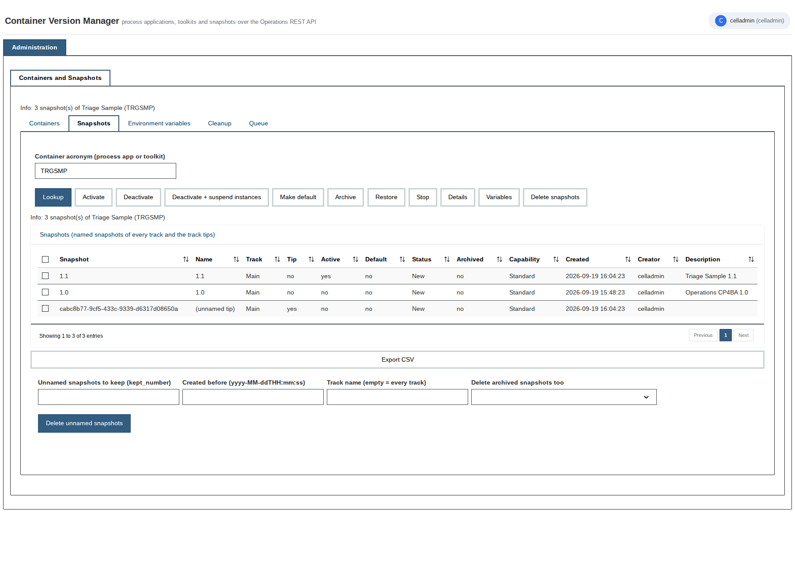

# Container Version Manager

Process applications, toolkits and their snapshots of an IBM Business Automation Workflow server administered through the Operations
REST API - the wsadmin-free console for traditional BAW and CP4BA. A process application built from out-of-the-box building blocks only
(UI Toolkit, client-side human service, business objects, Ajax service flows on `/ops`; no scripts in the views, no third-party toolkit),
on the REST machinery of [Process Tools REST](https://github.com/dosvak/process-tools-rest).

| Tab | Content | Actions |
|---|---|---|
| Containers | process apps and toolkits (kind and text filter), orphaned toolkit snapshots | Lookup, Snapshots of container, Archive, Restore, Delete (confirmation), Orphaned toolkit snapshots, Export CSV |
| Snapshots | snapshots of a container (named snapshots of every track and the track tips): active, default, status, archived, capability, created, creator | Activate, Deactivate, Deactivate + suspend instances, Make default, Archive, Restore, Stop, Details (snapshot, environment variables, EPVs, team bindings), Variables, Delete snapshots, unnamed snapshot cleanup (kept number, created before, archived; Workflow Center), Export CSV |
| Environment variables | variables of a snapshot with their current values, EPV variables | Lookup, row selection -> editor, Set value, Export CSV |
| Cleanup | instance count and deletion by state / snapshot / end date (force, transaction slice); closed-task cleanup (BAW 24 / CP4BA); resume of suspended instances | Count instances, Delete instances, Delete closed tasks, Resume suspended instances (all with confirmation where destructive) |
| Queue | URL, status and result of the last accepted request (`GET /ops/system/queue/{id}`, or the result resource an accepted request points to) | Refresh status |

Every call is a documented `/ops/std/bpm/...` operation; the server's own answers (for example *CWTBG0688E: only on a workflow
server* for *Make default* on a Process Center, or *nothing to delete* from an unnamed snapshot cleanup) are shown as they arrive.

## Packages

| File | Target | Notes |
|---|---|---|
| [`packages/Container-Version-Manager-1.0.1.twx`](packages/Container-Version-Manager-1.0.1.twx) | traditional BAW / IBM BPM 8.6.x and later, CP4BA | process app **Container Version Manager** (`CVMGR`) 1.0.1 |

Dependencies: System Data and UI Toolkit only. The same file is attached to the [releases](../../releases).

## Install and configure

1. Import the package (Process Center console > *Import Process App*; CP4BA: Business Automation Studio > *Business automations* > *Import*).
2. Environment variables: `serverBaseURL` (the server as seen from itself), `restAuthUser` / `restAuthPassword` (technical user with
   administrator rights for the server-side REST calls; **the password ships empty - set it after the import**), `restTrustAllCertificates`,
   `opsHost` / `opsContextPath`, `bpmHost` / `bpmContextPath` (CSRF login), `csrfLoginPath`, `appTitle`, `logoURL`. On CP4BA use the
   `/bas` context paths (`/bas/ops`, `/bas/bpm`, `/bas/bpm/system/login`).
3. Expose the dashboard *Container Version Manager* to the administrators only - it deletes containers, snapshots and instances.

## Documentation and verification

[docs/DESIGN.md](docs/DESIGN.md) - function, every operation with its REST call, the API notes found on the way (tip snapshots, local
timestamps, Process Center refusals, closed-task cleanup only from BAW 24). [docs/TEST-LAB-8.6.2.md](docs/TEST-LAB-8.6.2.md) - the
automated playback test on BAW 8.6.2 / 20.0.0.1 (containers, filters, orphaned toolkits, restore / archive, snapshots, details,
deactivate / activate, make default, unnamed cleanup with queue, variables list / set / restore, instance count / deletion / result, closed
tasks, resume, CSV); screenshots in [docs/screenshots](docs/screenshots).

The package is generated from a declarative build in a private workspace of Dosvak LLC; the design document mentions its tools by name.

## License and attribution

Apache License 2.0 - see [LICENSE](LICENSE) and [NOTICE](NOTICE). You may use, modify and redistribute this software, including in
commercial products, provided the copyright notice, the license and the NOTICE file stay with every copy (attribution to Dosvak LLC).
